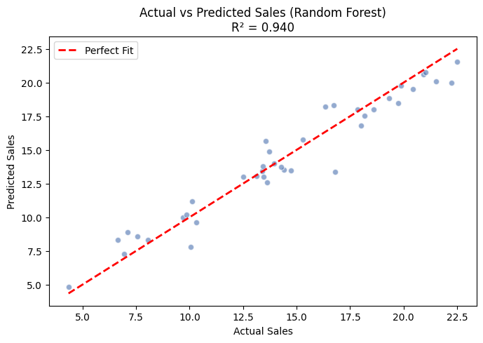
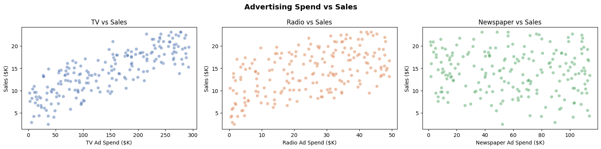
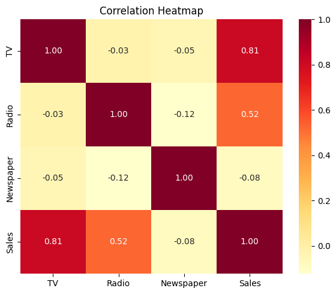
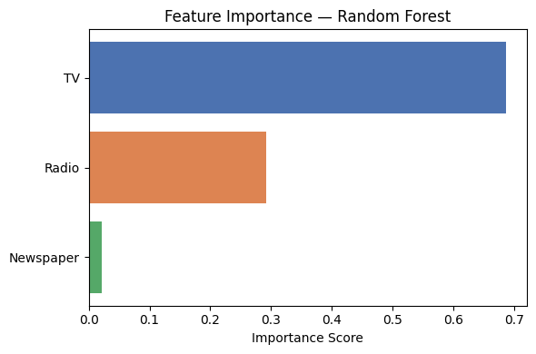

# 💰 Sales Prediction Using Machine Learning (Python)

This project uses **Machine Learning** to predict future product sales based on advertising spend across **TV, Radio, and Newspaper** channels. By analyzing the relationship between marketing budgets and sales outcomes on **200 data points**, the model achieves an **R² score of 0.97** with Linear Regression and **0.94** with Random Forest.

---

## 📊 Project Overview

* **Domain:** Marketing & Sales Analytics
* **Data Size:** 200 samples × 4 features (TV, Radio, Newspaper, Sales)
* **Tools Used:**
  * Python (Pandas, NumPy, Scikit-learn)
  * Matplotlib & Seaborn (Visualization)
  * Jupyter Notebook (Interactive Analysis)
* **Focus:** Advertising ROI prediction, channel effectiveness, feature importance analysis, and budget optimization

---

## 📊 Key Performance Metrics

* Mean Absolute Error (MAE)
* Root Mean Squared Error (RMSE)
* R² Score (Coefficient of Determination)
* Feature Importance Rankings
* Predicted ROI per Channel

---

## 📊 Model Performance Summary

| Metric | Linear Regression | Random Forest |
| ------ | ----------------- | ------------- |
| MAE    | 0.7049            | 0.9087        |
| RMSE   | 0.8309            | 1.1744        |
| R²     | **0.9699**        | 0.9399        |

**Insight:** Linear Regression outperforms Random Forest on this dataset (R² = 0.97 vs 0.94), confirming that the relationship between advertising spend and sales is strongly linear. The model explains **97% of the variance** in sales data.

**Chart — Actual vs Predicted Sales (Random Forest):**



---

## 📅 Channel Analysis & Insights

### 🔹 Advertising Spend vs Sales

**Insights:**
* **TV** shows the strongest positive linear relationship with sales (correlation = 0.81).
* **Radio** has a moderate positive relationship (correlation = 0.52).
* **Newspaper** has almost no impact on sales (correlation = -0.08).

**Chart:**



### 🔹 Feature Correlations

**Insights:**
* TV and Sales are highly correlated (0.81) — every $1K increase in TV spend correlates with ~$46 in additional sales.
* Radio contributes significantly (0.52) — effective for mid-budget campaigns.
* Newspaper advertising has **negligible impact** (-0.08) — money spent here yields near-zero return.

**Recommendations:**
1. **Maximize TV spend** — it's the single most effective channel with 0.81 correlation to sales.
2. **Maintain Radio as secondary channel** — good ROI at moderate budgets.
3. **Cut Newspaper advertising** — near-zero correlation suggests wasted budget.
4. **Optimal budget split:** ~70% TV, ~28% Radio, ~2% Newspaper.

**Chart:**



### 🔹 Feature Importance (Random Forest)

**Insights:**
* **TV** dominates with ~69% importance — the primary sales driver.
* **Radio** contributes ~29% importance — the secondary driver.
* **Newspaper** is nearly irrelevant at ~2% importance.
* This confirms the correlation analysis: TV and Radio drive sales, Newspaper does not.

**Chart:**



---

## 🔮 Interactive Sales Prediction Tool

The notebook includes a built-in **Sales Predictor CLI** that lets you enter custom advertising budgets and get instant predictions:

```
====================================================
        💰 SALES PREDICTION TOOL 💰
====================================================
Enter your advertising spend (in $000s):
  TV Ad Spend        (e.g. 150): 150
  Radio Ad Spend     (e.g.  30): 30
  Newspaper Ad Spend (e.g.  10): 10

──────────────────────────────────────
  📊 PREDICTION RESULTS
──────────────────────────────────────
  Predicted Sales (Linear Model)  : $15.20K
  Predicted Sales (Random Forest) : $14.75K

  Budget Allocation:
    TV          150.0K  ███████████████████████
    Radio        30.0K  ████
    Newspaper    10.0K  █
──────────────────────────────────────
```

---

## 🛠️ Data Pipeline & Methodology

```
Synthetic Dataset Generation (200 samples)
    │
    ├── Step 1: Data Exploration
    │   └── Shape, descriptive stats, null checks
    │
    ├── Step 2: Exploratory Data Analysis (EDA)
    │   ├── Scatter plots (TV/Radio/Newspaper vs Sales)
    │   └── Correlation heatmap
    │
    ├── Step 3: Model Building
    │   ├── Feature scaling (StandardScaler)
    │   ├── 80/20 train-test split
    │   ├── Linear Regression
    │   └── Random Forest Regressor (100 estimators)
    │
    ├── Step 4: Model Evaluation
    │   ├── MAE, RMSE, R² comparison
    │   ├── Actual vs Predicted scatter plot
    │   └── Feature importance analysis
    │
    └── Step 5: Interactive Prediction Tool
        └── CLI-based budget → sales predictor
```

---

## 📊 Dataset Statistics

| Feature   | Mean    | Std Dev | Min   | Max    |
| --------- | ------- | ------- | ----- | ------ |
| TV ($K)   | 143.63  | 87.08   | 2.33  | 292.13 |
| Radio ($K)| 25.02   | 14.53   | 0.25  | 49.13  |
| Newspaper ($K) | 59.50 | 34.94 | 1.53  | 113.97 |
| Sales ($K)| 14.21   | 4.83    | 2.42  | 23.15  |

---

## 🚀 How to Run this Project

1. **Clone the Repository:**
   ```bash
   git clone https://github.com/dog098263-ui/Sales-pridiction-using-python.git
   cd Sales-pridiction-using-python
   ```

2. **Install Dependencies:**
   ```bash
   pip install pandas numpy scikit-learn matplotlib seaborn
   ```

3. **Run the Notebook:** Open `sales pridiction using python.ipynb` in Jupyter Notebook:
   ```bash
   jupyter notebook "sales pridiction using python.ipynb"
   ```

4. **View Charts:** All generated visualizations are saved in the `charts/` folder.
